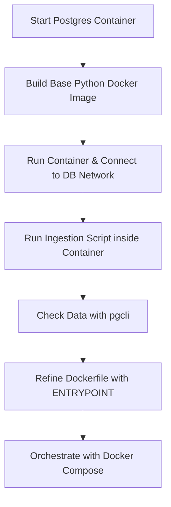

## Overall Concept
### The core objective of this workshop is to transition from a manual, local data workflow (running scripts on a host machine) to a containerized, automated pipeline. It demonstrates how to use Docker to ensure that the environment, the database, and the ingestion script are all portable and reproducible.
## Main Steps and Logic
### Step 1: Introduction & Basic Docker Operations
#### - Action: Understanding Docker basics (run, build, images).
#### - Logic: This provides the foundational tools. Before building a complex system, you must understand how to isolate a single process.
### Step 2: Database Setup (PostgreSQL & pgAdmin)
#### - Action: Running a Postgres database and a management tool (pgAdmin) inside Docker containers.
#### - Logic: A pipeline needs a destination. By containerizing the database, you create a persistent storage layer that doesn't require local installation.
### Step 3: Data Ingestion Development (Python & Pandas)
#### - Action: Writing a Python script to download the NY Taxi dataset and upload it to Postgres.
#### - Logic: We have a database, but it is empty. Effect: This script acts as the "bridge" to move data from the web into our containerized storage.
### Step 4: Containerizing the Ingestion Script (Dockerfile)
#### - Action: Wrapping the Python script and its dependencies into a custom Docker image.
#### - Logic: The script works locally but depends on specific Python libraries. To avoid "it works on my machine" issue, we create a Dockerfile ensures the script will run exactly the same way anywhere, regardless of the host's Python version.
### Step 5: Multi-Container Orchestration (Docker Compose)
#### - Action:Using a YAML file to define and link the Database, pgAdmin, and Ingestion script in one network.
#### - Logic: Running multiple docker run commands manually is error-prone and requires manual networking. Docker Compose automates the entire "stack," allowing all components to communicate seamlessly with a single command.
## Logical Flow Chart

## Summary
#### The progression follows a "Manual -> Isolated -> Orchestrated" path. You start with the Infrastructure (Postgres), then build the Application (Python script), then Package the application (Dockerfile), and finally Connect everything (Docker Compose) to solve the "it works on my machine" problem.
